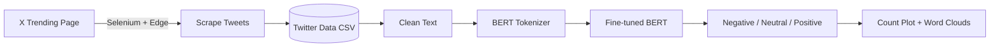

# 🐦 Twitter (X) Sentiment Analysis and Web Scraping using BERT

[](https://www.python.org/downloads/)
[](https://www.selenium.dev/)
[](https://huggingface.co/docs/transformers)
[](https://pytorch.org/)
[](https://jupyter.org/)
[](https://opensource.org/licenses/MIT)

An end-to-end NLP project that **scrapes live tweets from X (formerly Twitter) with Selenium** and classifies each tweet as **Positive, Neutral or Negative** using a **fine-tuned BERT model**. The pipeline covers data collection, cleaning, model inference and visualization (sentiment distribution plot and word clouds).

---

## 📑 Table of Contents

- [Project Overview](#-project-overview)
- [Key Features](#-key-features)
- [Pipeline](#-pipeline)
- [Tech Stack](#-tech-stack)
- [Repository Structure](#-repository-structure)
- [Dataset](#-dataset)
- [How It Works](#-how-it-works)
- [Installation](#-installation)
- [Configuration](#-configuration)
- [Usage](#-usage)
- [Results and Visualizations](#-results-and-visualizations)
- [Known Limitations](#-known-limitations)
- [Troubleshooting](#-troubleshooting)
- [Future Improvements](#-future-improvements)
- [Disclaimer](#-disclaimer)
- [License](#-license)
- [Author](#-author)

---

## 📌 Project Overview

Public opinion on social media moves fast. This project demonstrates how to turn raw, unstructured tweets into measurable sentiment:

1. **Collect** tweets from a chosen X trending page by automating a real browser (Microsoft Edge) with Selenium.
2. **Clean** the text (URLs, mentions, hashtags and special characters removed).
3. **Classify** each tweet with a locally fine-tuned **BERT** model into three classes.
4. **Visualize** the results with a count plot and per-sentiment word clouds.

Everything lives in a single Jupyter Notebook: `Sentiment Analysis with Web Scraping.ipynb`.

---

## ✨ Key Features

- **Selenium-based scraper** (`Xcraper` class) that scrolls a trending page and extracts tweets automatically.
- **Cookie-based authentication** using the `auth_token` cookie, so no username/password typing is needed.
- **Anti-detection settings** for the browser (hides the `navigator.webdriver` flag, disables the automation banner, custom user agent).
- **Human-like scrolling** with random 3-5 second delays between scrolls.
- **Duplicate protection**: tweets are de-duplicated using the handle plus the first 50 characters of the text.
- **Automatic CSV export** with a timestamped file name, e.g. `Twitter Data 20260525_103255.csv`.
- **Text preprocessing** using regular expressions.
- **BERT sentiment classifier** (`BertForSequenceClassification`, 3 labels) with a reusable `predict_sentiment()` function.
- **Visual analysis**: sentiment count plot and separate word clouds for positive, neutral and negative tweets.

---

## 🔄 Pipeline



---

## 🛠 Tech Stack

| Area | Tools |
|---|---|
| Language | Python 3.8+ |
| Web scraping | Selenium, Microsoft Edge WebDriver |
| Data handling | pandas, `re` (regex) |
| NLP / Deep learning | Hugging Face `transformers` (BERT), PyTorch |
| Visualization | seaborn, matplotlib, wordcloud |
| Environment | Jupyter Notebook |

---

## 📂 Repository Structure

```
Twitter-Sentiment-Analysis-and-Web-Scraping/
│
├── Sentiment Analysis with Web Scraping.ipynb   # Full pipeline: scraping, cleaning, BERT inference, plots
├── Twitter Data 20260525_103255.csv             # Sample scraped dataset (145 unique tweets)
└── README.md                                    # Project documentation
```

> ⚠️ The fine-tuned model folder `bert_finetuned_local/` is **not included** in this repository. See [Installation](#-installation) for how to provide your own.

---

## 📊 Dataset

The included CSV was scraped on **25 May 2026** from an X trending page.

| Column | Description |
|---|---|
| `name` | Display name of the account that posted the tweet |
| `handle` | The account's @handle |
| `text` | Raw tweet text |
| `timestamp` | When the tweet was posted (ISO 8601, from the tweet's `<time>` element) |
| `collected_at` | When the tweet was scraped (ISO format) |

**Quick facts**

- 145 unique tweets from 135 unique accounts
- 5 columns, no missing values
- Tweet text can span multiple lines, so the CSV has more physical lines than rows. Always load it with `pandas.read_csv()`.

After processing, two more columns are added in the notebook: `clean_text` and `sentiment`.

---

## ⚙️ How It Works

### 1. Web scraping (`Xcraper` class)

| Method | What it does |
|---|---|
| `setup_driver(headless)` | Starts Microsoft Edge with anti-detection options. Supports headless mode. |
| `inject_auth_cookie()` | Opens `x.com`, injects the `auth_token` cookie, refreshes, and checks that the URL no longer contains `login`. |
| `scrape_trending_page(url, max_scrolls)` | Opens the trending page, scrolls up to `max_scrolls` times, collects every `article[data-testid='tweet']`, removes duplicates, then closes the browser. |
| `extract_tweet_data(article)` | Pulls name, handle, text and timestamp from a single tweet element. |
| `close()` | Closes the browser safely. |

### 2. Text cleaning (`clean_text`)

Applied in this order:

1. Convert to lowercase
2. Remove URLs (`http...`)
3. Remove @mentions
4. Remove #hashtags
5. Remove everything except letters `a-z` and whitespace (this drops numbers, punctuation and emojis)

### 3. Sentiment prediction (`predict_sentiment`)

- Loads `BertTokenizer` and `BertForSequenceClassification` from the local folder `bert_finetuned_local` with `num_labels=3`
- Cleans the text, tokenizes it (`max_length=128`, padding and truncation on) and runs inference in `eval()` mode with `torch.no_grad()`
- Moves inputs to the same device as the model (CPU or GPU)
- Takes the `argmax` of the logits and maps it to a label:

| Class index | Label |
|---|---|
| 0 | negative |
| 1 | neutral |
| 2 | positive |

### 4. Visualization

- `sns.countplot` of predicted sentiments
- One word cloud each for positive, neutral and negative tweets (English stopwords removed)

---

## 🚀 Installation

### Prerequisites

- Python 3.8 or higher
- Microsoft Edge browser (Selenium 4.6+ downloads the matching driver automatically)
- An X (Twitter) account, used only to obtain your own `auth_token` cookie
- A fine-tuned 3-class BERT model saved in a folder named `bert_finetuned_local`

### Steps

```bash
# 1. Clone the repository
git clone https://github.com/ajayn3300/Twitter-Sentiment-Analysis-and-Web-Scraping.git
cd Twitter-Sentiment-Analysis-and-Web-Scraping

# 2. (Recommended) create a virtual environment
python -m venv venv
source venv/bin/activate        # Windows: venv\Scripts\activate

# 3. Install dependencies
pip install pandas selenium seaborn matplotlib wordcloud transformers torch jupyter
```

### Providing the BERT model

The notebook expects a Hugging Face model directory named `bert_finetuned_local/` in the project root, containing the model weights, config and tokenizer files. It must be a **3-class** sequence classification model with the label order `0 = negative, 1 = neutral, 2 = positive`.

You can create one by fine-tuning `bert-base-uncased` on any labelled 3-class sentiment dataset and saving it:

```python
model.save_pretrained("bert_finetuned_local")
tokenizer.save_pretrained("bert_finetuned_local")
```

---

## 🔐 Configuration

The notebook has a small configuration cell:

```python
auth_token   = "YOUR_AUTH_TOKEN"   # X session cookie value
headless     = False               # True = run the browser in the background
trending_url = "https://x.com/i/trending/<TRENDING_ID>"  # page to scrape
max_scrolls  = 25                  # how many times to scroll down
```

### Getting your `auth_token`

1. Log in to [x.com](https://x.com) in your browser.
2. Open Developer Tools (`F12`) → **Application** (or **Storage**) → **Cookies** → `https://x.com`.
3. Copy the value of the cookie named `auth_token`.

### ⚠️ Keep your token private

The `auth_token` gives full access to your logged-in X session. **Never commit it to GitHub.** Load it from an environment variable instead:

```python
import os
auth_token = os.getenv("X_AUTH_TOKEN")
```

```bash
# macOS / Linux
export X_AUTH_TOKEN="your_token_here"

# Windows (PowerShell)
$env:X_AUTH_TOKEN="your_token_here"
```

If a token was ever pushed to a public repository, log out of X (which invalidates the session) and generate a new one.

---

## ▶️ Usage

1. Start Jupyter:
   ```bash
   jupyter notebook
   ```
2. Open **`Sentiment Analysis with Web Scraping.ipynb`**.
3. Set `auth_token`, `trending_url` and `max_scrolls` in the configuration cell.
4. Run the cells from top to bottom:
   - **Scrape** → an Edge window opens, logs in with your cookie and scrolls the page
   - **Save** → tweets are written to `Twitter Data <date>_<time>.csv`
   - **Clean** → creates the `clean_text` column
   - **Predict** → creates the `sentiment` column
   - **Visualize** → count plot and word clouds

### Predict a single text

```python
predict_sentiment("This product is absolutely fantastic, I love it!")
# -> 'positive'
```

### Skip scraping and use the included data

If you only want to try the analysis, skip the scraping cells and load the sample CSV:

```python
df = pd.read_csv("Twitter Data 20260525_103255.csv")
```

Then continue from the **Data Preprocessing** section.

---

## 📈 Results and Visualizations

Running the notebook on the sample data produces:

- **Sentiment distribution**: a count plot showing how many tweets fall into each class
- **Positive word cloud**: most frequent words in positive tweets
- **Neutral word cloud**: most frequent words in neutral tweets
- **Negative word cloud**: most frequent words in negative tweets

You can save your own plots into a `images/` folder and embed them here:

```markdown

```

---

## ⚠️ Known Limitations

- **Fragile scraping**: the scraper depends on X's current HTML (`data-testid` attributes). If X changes its page structure, the selectors will need updating.
- **Session required**: a valid `auth_token` is needed, and it expires when the session ends.
- **Limited volume**: X loads only a few tweets at a time, so the 25 scrolls used here yielded 145 unique tweets.
- **English-centric cleaning**: `clean_text` keeps only `a-z` letters, so non-English text (for example Hindi) is stripped out entirely.
- **Model not bundled**: you must supply your own `bert_finetuned_local` model.
- **No evaluation metrics**: the notebook runs inference only; accuracy, F1 and similar metrics are not reported because the scraped tweets are unlabelled.
- **No engagement metrics**: likes, retweets and replies are not collected.

---

## 🧰 Troubleshooting

| Problem | Fix |
|---|---|
| `Login failed. Check your auth_token.` | The token is expired or wrong. Log in again and copy a fresh `auth_token`. |
| Edge does not open / driver error | Update Edge and Selenium (`pip install -U selenium`). Selenium 4.6+ manages the driver automatically. |
| `OSError: bert_finetuned_local not found` | Place your fine-tuned model folder in the project root with that exact name. |
| `NameError: WordCloud is not defined` | Run the cell that contains `from wordcloud import WordCloud` before the first word cloud cell, or move that import to the top of the notebook. |
| Very few tweets collected | Increase `max_scrolls` or confirm the trending URL is valid and loads while logged in. |
| Garbled text in Excel | Open the CSV with UTF-8 encoding, or read it with `pandas`. |

---

## 🔮 Future Improvements

- Add engagement metrics (likes, retweets, replies, views)
- Support multilingual tweets (for example `bert-base-multilingual` or XLM-RoBERTa)
- Add a model training notebook with accuracy, precision, recall and F1 score
- Move the scraper into a standalone `.py` module with a command-line interface
- Add time-series sentiment tracking across multiple scraping runs
- Build an interactive dashboard with Streamlit
- Add a `requirements.txt` and pin versions

---

## 📜 Disclaimer

This project is for **educational and research purposes only**. Automated scraping of X may violate its Terms of Service, so use it responsibly, respect rate limits, and review the platform's current rules before collecting data. Scraped tweets are public posts by real people, so handle the data ethically and do not use it to harass or profile individuals. Sentiment predictions are model outputs and can be wrong, especially for sarcasm, mixed emotions and short texts.

---

## 👤 Author

**Ajay**  
GitHub: [@ajayn3300](https://github.com/ajayn3300)

⭐ If you found this project useful, consider giving it a star!
